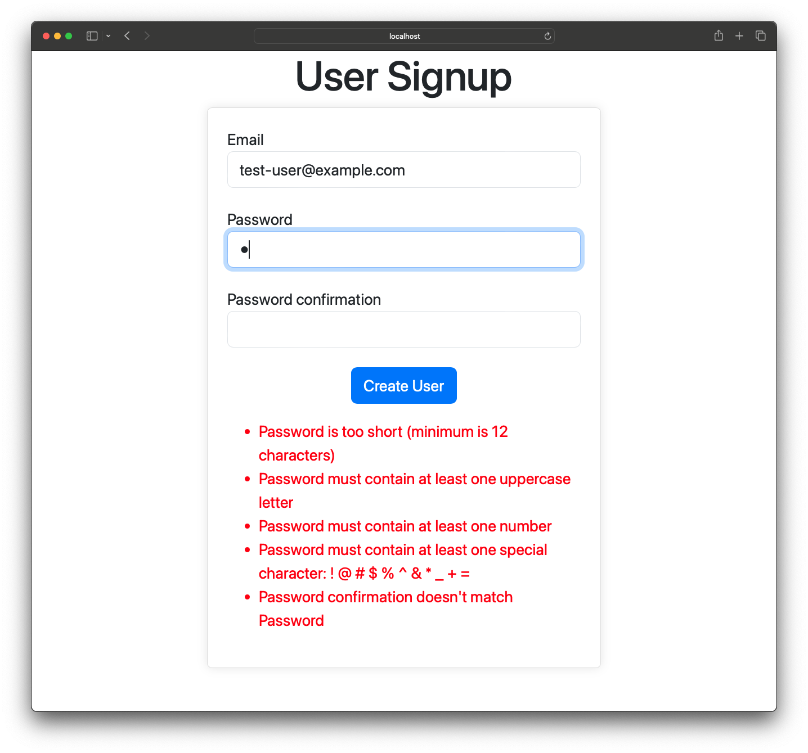
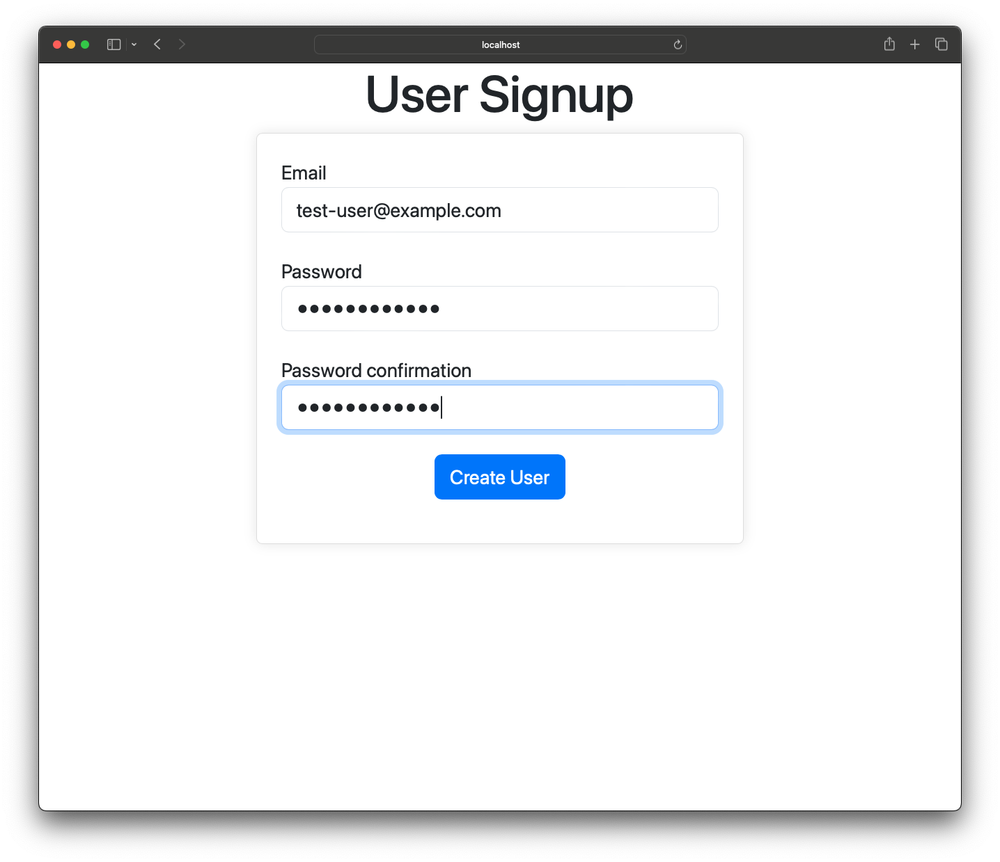
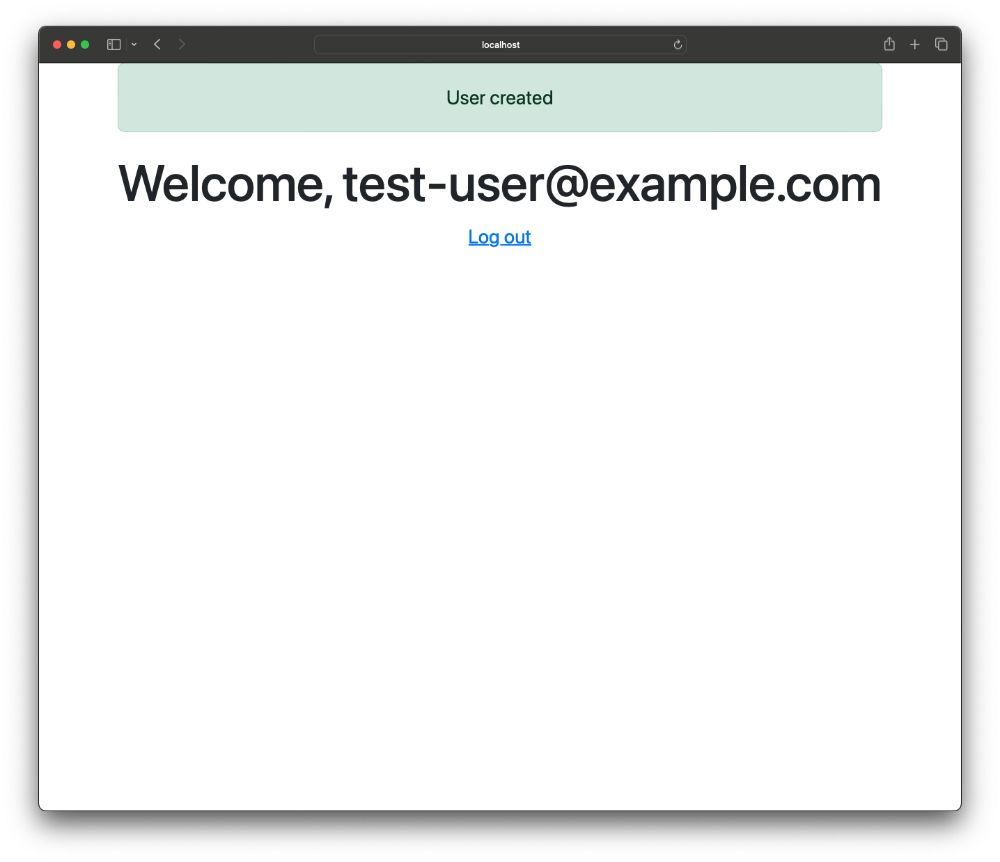

# Rails Realtime Password form Validation

This is a sample app that allows a user to signup and set a password.
Password requirements are displayed dynamically on the page as the user types.

## Table of Contents

- [Getting Started](#getting-started)
  - [Prerequisites](#prerequisites)
  - [Installation](#installation)
- [Usage](#usage)
- [Tests](#tests)
- [Technologies Used](#technologies-used)
- [Design](#design)

## Getting Started

### Prerequisites

- Ruby 3.2.2
- Bundler
- Node
- Postgres

### Installation

```sh
bundle
bin/setup
rails assets:precompile
bin/dev
```

## Usage

Go to User signup:
http://localhost:3000/users/new


Type email and password and see password requirements appear:



Meet all the requirements and errors will go away:



Click 'Create User' and user will be created and logged in:



## Tests

This project is tested using RSpec.
To run tests run RSpec from a terminal: `rspec`

## Technologies Used

- Rails
- Postgres
- Bootstrap
- Stimulus

## Design
Dynamic form validation is done using a Stimulus controller and a Rails backend endpoint that returns validation errors as a html snippet.

The signup form is wired up to a Stimulus controller. Password field actions are set to listen for input changes and trigger `handleChange` on the Stimulus controller.

[Form](./app/views/users/_form.html.erb):
```erb
<!-- Set Stimulus controller and url endpoint for validations -->
<div class="form-container" data-controller="form-validation" data-form-validation-url-value="<%= form_validations_users_path %>">
  <!-- Adds target to form to send data to Stimulus controller -->
  <%= form_with(model: user, class: 'needs-validation', novalidate: true, data: { form_validation_target: "form" }) do |f| %>
    ...
    <div class="form-group">
      <%= f.label :password %><br>
      <!-- Calls handleChange on Stimulus controller when the field changes -->
      <%= f.password_field :password, class: 'form-control', value: user.password, data: { action: "form-validation#handleChange" }, required: true %>
    </div>

    <div class="form-group">
      <%= f.label :password_confirmation %><br>
      <!-- Calls handleChange on Stimulus controller when the field changes -->
      <%= f.password_field :password_confirmation, class: 'form-control', value: user.password_confirmation, data: { action: "form-validation#handleChange" }, required: true %>
    </div>

    <p>
      <%= f.submit class: 'btn btn-primary' %>
    </p>
    <!-- Sets output for Stimulus controller. Errors will be displayed here -->
    <div class="error-explanations" data-form-validation-target="output">
      <%= render 'form_errors', user: user %>
    </div>
  <% end %>
</div>
```

The Stimulus controller call a Rails backend endpoint to validate the form data and update the page.

[Stimulus Controller](./app/javascript/controllers/form_validation_controller.js):
```javascript
export default class extends Controller {
  static targets = ["form", "output"];
  static values = { url: String };

  initialize() {
    // use debounce so backend validations are called when a user stops typing
    this.handleChange = debounce(this.handleChange, 500).bind(this);
  }

  handleChange(event) {
    // get all the data from the form so we can send it to backend
    const formData = new FormData(this.formTarget)

    // call the backend form validation endpoint
    fetch(this.urlValue, {
      method: "POST",
      headers: {
        'X-CSRF-Token': document.querySelector('meta[name="csrf-token"]').getAttribute('content')
      },
      body: formData
    })
    .then(response => response.text())
    .then((html) => {
      // update the page with errors html
      this.outputTarget.innerHTML = html;
    })
  }
}
```

The Rails backend validation controller uses the validations defined in the Model. This allows password requirements to be defined on the backend only, keeping the code DRY.

[Form Validations Controller](./app/controllers/form_validations/users_controller.rb):
```ruby
class FormValidations::UsersController < UsersController
  def create
    @user = User.new(user_params)
    @user.validate # Uses model valiations to validate the form
    respond_to do |format|
      format.text do
        render partial: "users/form_errors", locals: { user: @user }, formats: [:html]
      end
    end
  end
end
```

[User Model Validations](./app/models/user.rb)
```ruby
class User < ApplicationRecord
  ALLOWED_PASSWORD_SPECIAL_CHARS = %w(! @ # $ % ^ & * _ + =).freeze

  validates :email, presence: true, uniqueness: true
  validates :email, format: { with: URI::MailTo::EMAIL_REGEXP }
  validates :password, length: { minimum: 12 }
  validates :password, format: { with: /[a-z]{1,}/, message: "must contain at least one lowercase letter" }
  validates :password, format: { with: /[A-Z]{1,}/, message: "must contain at least one uppercase letter" }
  validates :password, format: { with: /[0-9]{1,}/, message: "must contain at least one number" }
  validates :password, format: {
    with: /[#{ALLOWED_PASSWORD_SPECIAL_CHARS.join}]{1,}/,
    message: "must contain at least one special character: #{ALLOWED_PASSWORD_SPECIAL_CHARS.join(' ')}"
  }

  has_secure_password :password, validations: true
end

```